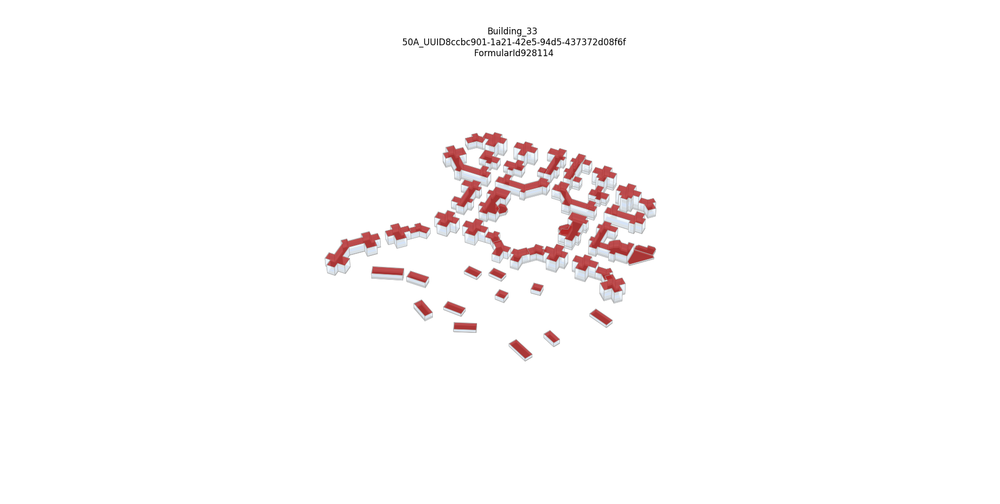

# MUBES_UBEM
MUBES_UBEM propose a workflow that creates automatic building energy models for EnergyPlus software.
Several thermal zoning options are proposed from single heated and non heated zones up to core and perimeter zones for each building floor.
It can launch simulations using parallele computing or can automatically creates FMUs of each building in order to make Co-Simulation afterward (co-simulation process validated in Windows but not curretnly in Linux even though FMUs are created in Linux).  
The main input file is in a geojson format. It contains the footprint including height (3D vertexes) of each building surfaces as well as some propreties taken from several databases (EPCs, and others)

## Environments
it is a python script based UBEM simulation tool using EnergyPlus (EP) as the core engine.
It has been developed in Python 3.7 with EP 9.1 and has been successfully tested with EP 9.4. and pyhton 3.8 on Ubuntu 20.04 (tested on Oracle Virtual Machine).
It is based on 2 main packages: [EPPY](https://github.com/santoshphilip/eppy) and [GeomEppy](https://github.com/jamiebull1/geomeppy).

## Installation process
The needed package are given in the requirements.txt file.
GeomEppy needs to be taken (by cloning or forking, or other way) from https://github.com/xavfa/geomeppy and make sure it is pointing on the correct branch (MultiFloor_complexe_Building) as many changes have be done in order to comply with more complex building footprints.
Besides, other changes might be also needed as MUBES_UBEM is just at the beginning of its development.
geomeppy package needs to be installed at the same level as MUBES_UBEM.
The FMUs creation option uses the [EnergyPlusToFMU-v3.1.0](https://simulationresearch.lbl.gov/fmu/EnergyPlus/export/userGuide/download.html) toolkit developed by LNBL. This toolkit should be downloads and installed at the same level as MUBES_UBEM under a folder named __FMUsKit__ (see BuildFMUs.buildEplusFMU() in the CoreFile folder).  
/!\ On the environment in which the UBEM process has been developed (Windows 10), some time delay had to be introduced in the original code to enable to remove the intermediate file and make the FMU reach the end properly (https://github.com/lbl-srg/EnergyPlusToFMU/issues/54).  
  

## Folder organization
The MUBES_UBEM main folder contains several subfolder:  
__CoreFile__ folder: contains all the core python scripts for the severals levels of the building design process.  
__ExternalFiles__ Folder : contains commun external files that one would use for all the buildings considered in the process. It currently contains the times series of input cold water temperature for the Domestic Hot Water needs as well as the water tps in l/min. The latter is an output of an other packages ([StROBe](https://github.com/open-ideas/StROBe)) that enables to create stochastics ouputs for residential occupancy.    
__BuildObject__ Folder : contains the building class object as well as the default choices for missing inputs. The latter might (or should) be modified by the modeler depending for its studied cases.  
__ModelerFolder__ : contains severals templates to build the process, select the required ouputs, and paths for the process to be launched.  
__ReadResults__ : contains one template to read the results and some functions for post-processing in the Utilities.py file.  

## Run simulation case
The __ModelerFolder__ is the playground of the Modeler. Within this folder, several templates are proposed. These are to be copy\paste in order to enable new release/updates from the templates without altering your local environements.
the templates are :  
__Pathways_Template.txt__ : This file gives the paths to your local path of energyplus and to the needed geojson intputs files (one file for the buildings and one file for the shading walls of the surrounding environement of each building). Its name is given as parameter in the builder file(see below). **This file is to be modified with local paths** .      
__Outputs_Template.txt__ : This file proposes a list of available outputs from EP. It has been build from a .rdd file from EP. The required outputs should be indicated in this file. It also indicate at which frequency the modeler wants his ouputs.  
__CaseBuilder_Template.py__ : this is the main builder file. This templates gives an example for a full process to be launched (having a input goejson file though !). ReadCarefuly the comments below the if __name__ == '__main__' : as important choices are to be done here by the modeler before launching a simulation.  
This file deals with the construction of the .idf file for each building and either launches the parallele computing option for all or create the FMUs of all buildings. It will automatically create a folder (at the same level of main MUBES_UBEM folder and if not already created) that will be called __MUBES_SimResults__ and that will have subfolder for each case that is launched. The subfolder will be named as the CaseName in the CaseBuilder scripts (see comments below the if __name__ == '__main__' : ).  

Some few other files are present in this folder :  
__PlotBuilder.py__ : enable to make 3D Matplotlib figures out of the idf files. It will plot all the buildings that are considered or each building appart depending on the option.  
__FMUSimPlayGround.py__ : it uses FMI++ package and as been successfully tested for controling temperature setpoints, or watertaps at each time steps of the simulation. For one how'd like to make co-simulation, a deep understanding is also need on the EP side as inputs and ouputs are to be defined. The CaseBuilder, using CreateFMU = True, proposes by default the temperature setpoints and the water taps as inputs and the averaged indoor temperature, the total power for heet needs and for domestic hot water as outputs.  
The example proposed is very simple (and not really relevant in terms of energy concerns): it reads an external file to feed the water taps at each time step, and depending on a threshold of water taps flow, the temperature set points are changed.
  
the __ReadResults__ folder contains also a template for post-processing the results :  
__ReadOutputs_Template.py__ : this script propose a basic post-treatment stage including reading the data, ploting the areas of footprint and the related energy as well as some times series for specific building number.  
__Utilities.py__ : contains several useful function for the post-treatement stage. The _getData()_ is highly helpful, it gathers all the pickle files present in a directory into one dictionnary. It can deal with several CaseNames and overplotts results for same Building Ids.    
  
The systems and building caracteristics are taken from the available data in the goejson file and\or in the _DB_Data.py_ file in the __BuildObject__ folder that contains several dictionnaries needed as inputs. The modeler is highly invited to look along this file to understand all the different thermal elements that are needed for the simulation.  

**Example of building geometry construction using MUBES_UBEM for Minneberg District, Stockholm, Sweden**  
The corresponding goejson files are given in the ModelerFolder. This example can be launched after having changed the paths to local ones in the Pathways_Template.txt file.  
  
_python3_ _CaseBuilder.py_ enable to make all the simulations.  
_python3_ _PlotBuilder.py_ will read all the building and make the figure below on your environment.  
By changing the *createFMU* key in *True*, in CaseBuilder, it will automatically create FMUs for each building.  
*python3 FMUSimPlayGround.py* enable to launch a co-simulation with the above simple temperature's setpoint modulation law for each building based on water taps.  

## Engine structure
The paradigm of simulation engine is to automate simulation on several different levels :
- simulation level (deals with simulation parameters),
- building level (deals with geometry, envelope and material),
- zone level (deals with internal loads, HVAC and all element needed at the zone level), and then 
- output levels (deals with outpouts variables and frequency).

## Credits
This work is develped within KTH/SEED/RIE/Urban Team, funded by MUBES' project.  
It has been developed with passion and is still in progress with passion.  
Hope you'll enjoy :)

