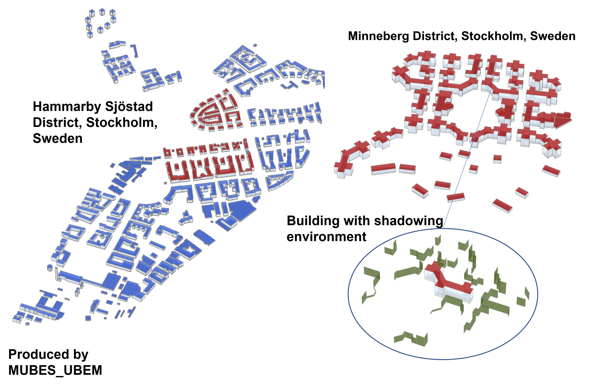

# MUBES_UBEM
MUBES_UBEM propose a workflow that creates automatic building energy models for EnergyPlus software.
Several thermal zoning options are proposed from single heated and non heated zones up to core and perimeter zones for each building floor.
It can launch simulations using parallel computing or can automatically creates FMUs of each building in order to make co-simulation afterward (the co-simulation process, using FMPy, is validated in Windows, Mac and Linux (Ubuntu)).  
The main input file is in a geojson format. It contains the footprint including height (3D vertexes) of each building's surface as well as some propreties taken from several databases (EPCs, and others).  
__Rq__:  Some new methods, more user-oriented are currently being developed in the ForAPI branch. The input file is dealt with .yml file and the Simlauncher can be launched using json format as argument. Some updates will come soon (you can still be informed by following the project in git).  
 

## Environments
It is a python script based UBEM simulation tool using EnergyPlus (EP) as the core engine.
It has been developed in Python 3.7 with EP 9.1 on Windows and has been successfully tested with EP 9.4 and python 3.9. on Windows and python 3.8 on Ubuntu 20.04 (tested on Oracle Virtual Machine) and with python 3.9 and EP 9.5 on OS x 11.5.2.
It is based on 2 main packages: [EPPY](https://github.com/santoshphilip/eppy) and [GeomEppy](https://github.com/jamiebull1/geomeppy).

## Installation process
The needed packages are given in the requirements.txt file.  
__Note__ : GeomEppy packages uses a specific branch of the original package.  
The FMUs creation option uses the [EnergyPlusToFMU-v3.1.0](https://simulationresearch.lbl.gov/fmu/EnergyPlus/export/userGuide/download.html) toolkit developed by LNBL. This toolkit should be downloaded and installed at the same level as MUBES_UBEM under a folder named __FMUsKit__ (see BuildFMUs.buildEplusFMU() in the CoreFile folder).  
The portability of FMUs (used on another computer than the one used to generate them) is valid but currently only when no external files are used as error are encountered when relative paths are defined.  
/!\ On Windows 10, some time delay had to be introduced in the original FMU toolkit code to enable to remove the intermediate files and make the FMU reach its end properly (https://github.com/lbl-srg/EnergyPlusToFMU/issues/54).  
  

## Folder organization
The MUBES_UBEM main folder contains several subfolders:  
__CoreFile__  : contains all the core python scripts for the several levels of the building design process.  
__ExternalFiles__  : contains commun external files that one would use for all the buildings considered in the process. It currently contains the times series of cold water input temperature for the Domestic Hot Water needs as well as the water taps in l/min. The latter is an output from an other packages ([StROBe](https://github.com/open-ideas/StROBe)) that enables to create stochastics outputs for residential occupancy.    
__BuildObject__  : contains the building class object as well as the default choices for missing inputs. The latter might (or should) be modified by the modeler depending on its studied cases.  
__ModelerFolder__ : contains severals templates to build the process, select the required ouputs, and paths for the process to be launched.  
__ReadResults__ : contains one template to read the results and some functions for post-processing in the Utilities.py file.  

## Run simulation case
The __ModelerFolder__ is the playground of the Modeler. Within this folder, several templates are proposed. These are to be copy/paste in order to enable new releases/updates from the templates without altering your local changes.  
The templates are :  
__Pathways_Template.txt__ : This file gives the paths to your local path of energyplus and to the needed geojson intput files (one file for the buildings and one file for the shading walls of the surrounding environement of each building). Its name is given as parameter in the builder file (see below). **This file is to be modified with local paths** .      
__Outputs_Template.txt__ : This file proposes a list of available outputs from EP. It has been build from a .rdd file from EP. The required outputs should be indicated in this file. It also indicates at which frequency the modeler wants his ouputs.  
__SimLauncher.py__ : this is the main builder file. This template gives an example for a full process to be launched. Read carefuly the comments below the *if __name__ == '__main__' :* as important choices are to be done here by the modeler before launching a simulation.  
This scripts is the main one. It deals with the construction of the .idf file for each building and either launches the parallel computing option for all or creates the FMUs of all buildings. It will automatically create a folder (at the same level of main MUBES_UBEM folder and if not already created) that will be called __MUBES_SimResults__ and that will have subfolders for each case that is launched. The subfolder will be named as the CaseName in the SimLauncher scripts (see comments below the *if __name__ == '__main__' :*).  

Some few other files are present in this folder :  
__PlotBuilder.py__ : enables to make 3D Matplotlib figures out of the idf files. It will plot all the buildings that are considered or each building appart depending on the available option.  
__FMPySimPlayGroundEx1.py__ and __FMPySimPlayGroundEx2.py__: it uses FMPy package and as been successfully tested for controlling temperature's setpoints, internal loads, or watertaps at each time steps of the simulation. For one who'd like to make co-simulation, a deep understanding is still needed on the EP side as inputs and ouputs are to be defined. The SimLauncher, using *CreateFMU = True*, proposes by default the temperature's setpoints and the water taps as inputs and the averaged indoor temperature, the total power for heat needs and for domestic hot water as outputs.  
The two examples (Ex1 and Ex2) :  
Ex1 : proposes a simple offset on the temperature setPoints. Every two hours a new building sees its setpoint decreases from 21degC to 18degC. the frequency of changes for each building thus depends on the size of the district that is considered. The internal Loads are also modified depending on working and nonworking hours  
Ex2 : proposes a couple temperature setpoints and water taps controls for each building, keeping the hourly based internal load inputs. It reads an external file to feed the water taps at each time step, and depending on a threshold of water taps' flow, the temperature's setpoints are changed.  
Ex1 is usable by default, Ex2 needs to have Domestic Hot Water in external file, so DB_Data.ExtraEnergy dictionnary in __BuildObject__  folder needs to be uncommented.  
  
The __ReadResults__ folder contains also a template for post-processing the results :  
__ReadOutputs_Template.py__ : this script proposes a basic post-processing stage including reading the data, ploting the areas of footprint and the energy needs as well as some times series for specific building number. Its works for simulation done with or without FMUs.  
__Utilities.py__ : contains several useful functions for the post-processing stage. The _getData()_ is highly helpful. It gathers all the pickle files present in a directory into one dictionnary. It can deal with several CaseNames and overplots results for same Building's Ids by simply appending the path's list.    
  
The systems and building's caracteristics are taken from the available data in the goejson file and\or in the _DB_Data.py_ file in the __BuildObject__ folder that contains several dictionnaries needed as inputs. The modeler is highly invited to look along this file to understand all the different thermal elements that are needed for the simulation.  

**Example of building geometry construction using MUBES_UBEM for Minneberg District, Stockholm, Sweden**  
The corresponding goejson files are given in the ModelerFolder. This example can be launched after having changed the paths to local ones in the Pathways_Template.txt file without any other modification.    
The weather conditions used by default are from San Francisco as the weather file is automaticaly provided while installing EnergyPlus (see _DB_Data.py_ in the __BuildObject__ folder).    
_python3_ _SimLauncher.py_ will create the idf files and will launch all the simulations.  
_python3_ _ReadOutputs_Template.py_ will read all the simulations' results and make some graphs as presented above.  
  
_python3_ _PlotBuilder.py_ will read all the buildings and make the figure below (full district present in the geojson file) on your environment. It will not alter the results as no simulations are launched here. A log file will be created though in order to have insights of potential geometry issues in the process.    
  
By changing the *createFMU* key in *True*, in SimLauncher, it will automatically create FMUs for each building.  

*python3 FMPySimPlayGroundEx1.py* enable to launch a co-simulation with the above simple temperature's setpoint and internal loads modulation law for each building.    

## Engine structure
The paradigm of simulation engine is to automate simulation on several different levels :
- simulation level (deals with simulation's parameters),
- building level (deals with geometry, envelope and material),
- zone level (deals with internal loads, HVAC and all elements needed at the zone level),
- output level (deals with outpouts variables and frequency).

## Credits
This work is developed within KTH/SEED/RIE/Urban Team, funded by MUBES' project.  
It has been developed with passion and is still in progress with passion.  
Hope you'll enjoy :)

## Citation
Faure, X.; Johansson, T.; Pasichnyi, O. The Impact of Detail, Shadowing and Thermal Zoning Levels on Urban Building Energy Modelling (UBEM) on a District Scale. Energies 2022, 15, 1525. https://doi.org/10.3390/en15041525

